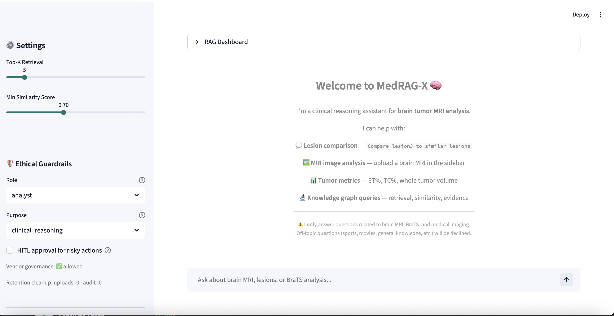
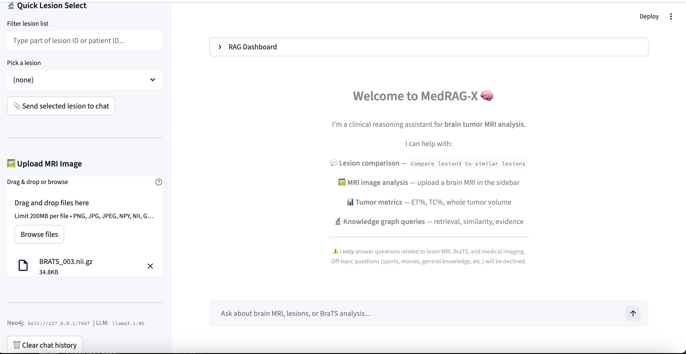
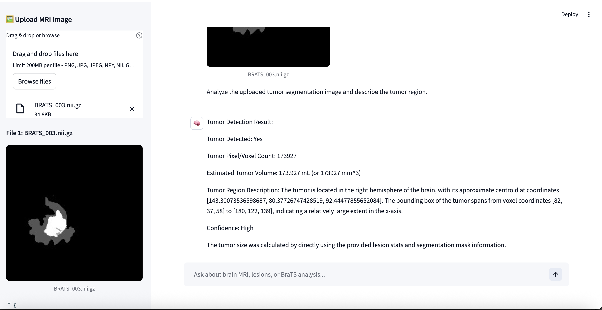
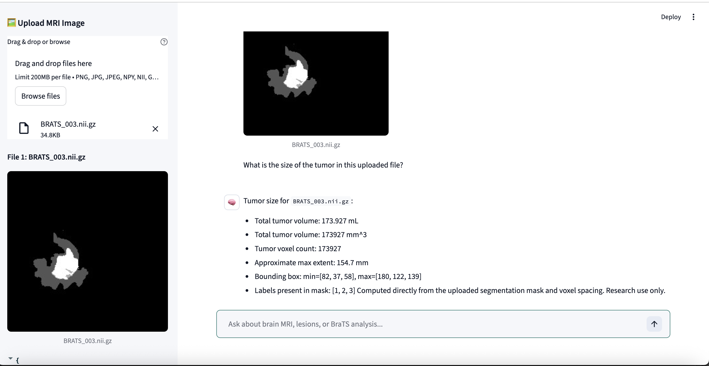
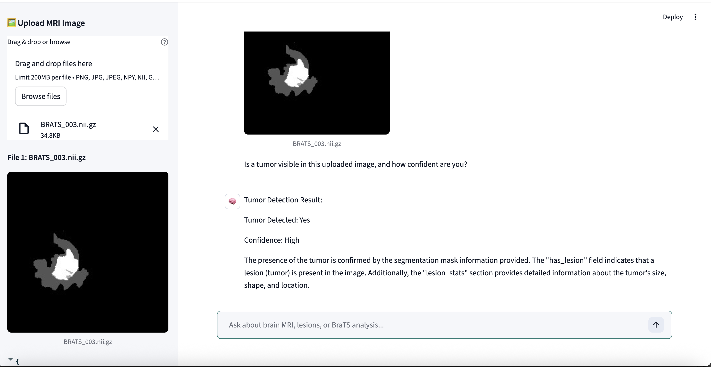
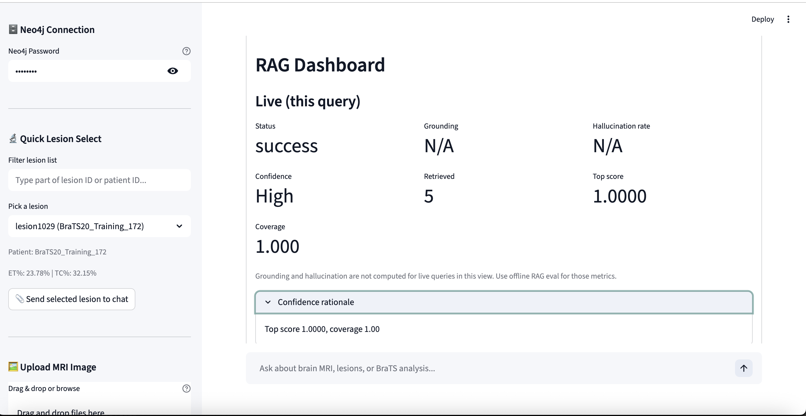
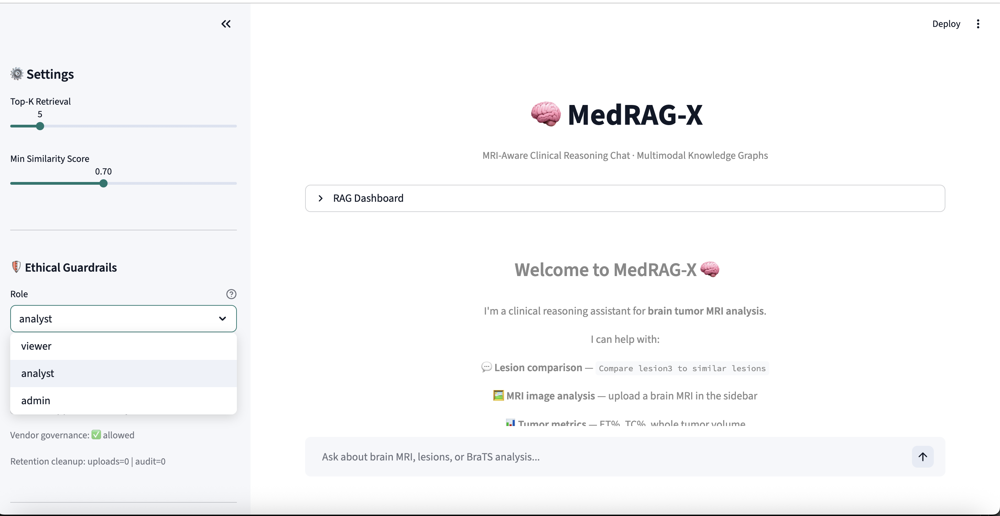
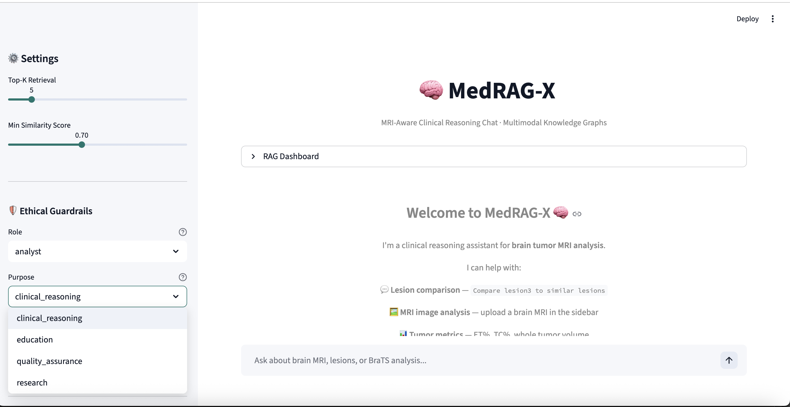

# 🧠 MedRAG-X
AI-Driven Brain Tumor Segmentation & Medical Knowledge Retrieval Platform

---

## 📌 Overview

**MedRAG-X** is an advanced AI-powered medical imaging platform that performs:

- Automatic **3D brain tumor segmentation** from MRI scans
- **Semantic medical knowledge retrieval** using vector databases
- **RAG-ready architecture** for future clinical LLM integration

The platform combines **medical imaging AI**, **deep learning**, and  
**retrieval-augmented generation (RAG)** to support intelligent clinical decision-making systems.

---

## 🚀 Features

- 🧠 3D MRI brain tumor segmentation  
- 📊 BraTS dataset ingestion  
- ⚙️ MONAI-based preprocessing pipeline  
- 🤖 Deep learning training workflow  
- 🔍 Multimodal embeddings  
- 📚 Semantic search  
- 🧠 RAG-ready modular architecture  

---

## 📊 Architecture Diagram

---

📂 Project Structure
MedRAG-X/
│
├── data/
│   ├── raw/                     # BraTS dataset
│   ├── processed/               # Preprocessed tensors
│   └── metadata/                # Dataset statistics
│
├── preprocessing/
│   ├── transforms.py
│   ├── dataset_loader.py
│   └── validation.py
│
├── models/
│   ├── unet3d.py
│   └── loss.py
│
├── training/
│   ├── trainer.py
│   ├── metrics.py
│   └── config.yaml
│
├── inference/
│   ├── predictor.py
│   └── visualization.py
│
├── embeddings/
│   ├── image_embeddings.py
│   ├── text_embeddings.py
│   └── multimodal_fusion.py
│
├── vector_store/
│   ├── faiss_store.py
│   ├── chroma_store.py
│   └── qdrant_store.py
│
├── rag/
│   ├── retriever.py
│   ├── context_builder.py
│   └── generator.py
│
├── app/
│   ├── streamlit_app.py
│   └── api.py
│
├── requirements.txt
├── README.md
└── LICENSE

📊 Dataset
BraTS 2020 MRI Dataset

Source: MICCAI Brain Tumor Segmentation Challenge

Format: NIfTI (.nii.gz)

Modalities:

T1

T1ce

T2

FLAIR

| Label | Description     |
| ----- | --------------- |
| 0     | Background      |
| 1     | Necrotic Core   |
| 2     | Edema           |
| 4     | Enhancing Tumor |

🤖 Model Details
| Component     | Description              |
| ------------- | ------------------------ |
| Architecture  | 3D U-Net                 |
| Framework     | PyTorch + MONAI          |
| Input         | 4-channel MRI            |
| Output        | Multi-class segmentation |
| Loss Function | Dice Loss                |
| Optimizer     | Adam                     |
| Training      | Patch-based              |
| Evaluation    | Dice coefficient         |

📈 Evaluation Metrics

    Dice Score
    Sensitivity
    Specificity
    Hausdorff Distance (optional)

🖥️ Installation
1️⃣ Clone repository

    git clone https://github.com/your-org/MedRAG-X.git
    cd MedRAG-X

2️⃣ Create virtual environment
    python3 -m venv venv
    source venv/bin/activate

3️⃣ Install dependencies
    pip install -r requirements.txt

### Regenerating Local Data

Raw datasets, preprocessed tensors, FAISS indexes, Neo4j CSV exports, checkpoints, and other generated artifacts are intentionally excluded from Git.

For the exact raw-data layout and regeneration commands, see [DATASETS.md](/Users/esai/Documents/capstoneg5/brats-3net/DATASETS.md).

## Project Screenshots

### Streamlit UI

### RAG Query Results

### RAG Dashboard

### Ethical Guardrails

▶️ Training
    python training/trainer.py --config training/config.yaml

🔍 Inference
    python inference/predictor.py \
  --input sample_mri.nii.gz \
  --output prediction.nii.gz

🔎 Semantic Search Example
    query = "Glioblastoma with enhancing tumor"
    results = vector_store.search(query, top_k=5)

🧠 RAG Usage (Future)
    context = retriever.retrieve(question)
    answer = llm.generate(context)

🔮 Future Scope
    🧠 Clinical LLM integration

    📝 Automated radiology report generation

    🔍 Explainable AI (Grad-CAM)

    🏥 PACS & DICOM integration

    🧬 Knowledge Graph (Neo4j) support

    🔗 Hybrid Vector + Graph RAG

    🌐 FHIR healthcare interoperability

    🔐 HIPAA-ready deployment

⚠️ Disclaimer
    This project is intended for research and educational purposes only.
    It is not approved for clinical diagnosis.

👨‍💻 Authors
    Esaikiappan Udayakumar
    Sameekadatta Vemuri
    Vineeth Bathula
    Harshvardhan Ganjir

📄 License
    This project is licensed under the MIT License.

## Ethical Guardrails (Implemented)

The project now enforces guardrails in both `/app/app.py` (Streamlit) and `/app/api.py` (FastAPI):

- Data minimization: query text is trimmed to policy limits and audited by hash.
- Purpose limitation: only approved purposes are allowed (`clinical_reasoning`, `research`, `education`, `quality_assurance` by default).
- Access control / least privilege: role-based action permissions (`viewer`, `analyst`, `admin`).
- Sensitive data controls: PII/secrets are redacted before audit logging and output display.
- Human-in-the-loop: risky requests (export/share/raw-context/secret-like input) require approval.
- Auditability: append-only JSONL audit log with hash chaining in `artifacts/audit/audit_log.jsonl`.
- Retention/deletion: startup cleanup removes old uploads and prunes old audit entries.
- Vendor governance: LLM host/model allowlisting is enforced for app-side LLM calls.

### Policy Environment Variables

- `GUARDRAIL_ALLOWED_PURPOSES` (comma-separated)
- `GUARDRAIL_ALLOWED_LLM_HOSTS` (comma-separated, supports globs)
- `GUARDRAIL_ALLOWED_MODELS` (comma-separated, supports globs)
- `GUARDRAIL_STRICT_VENDOR_CHECK` (`true`/`false`)
- `GUARDRAIL_MAX_QUERY_CHARS`
- `GUARDRAIL_MAX_AUDIT_PREVIEW_CHARS`
- `GUARDRAIL_RETENTION_DAYS`
- `GUARDRAIL_UPLOAD_RETENTION_DAYS`
- `GUARDRAIL_AUDIT_LOG`
- `GUARDRAIL_UPLOADS_DIR`
- `GUARDRAIL_DENY_ALERT_THRESHOLD`
- `GUARDRAIL_DENY_ALERT_WINDOW_MINUTES`

### API Security Headers

- `X-API-Key` (required when `MEDRAGX_API_KEYS` is configured)
- `X-Role` (used only when API keys are not configured)
- `X-Purpose`
- `X-HITL-Approved` (`true` for risky payloads)

Optional API key mapping format:

- `MEDRAGX_API_KEYS="key_viewer:viewer,key_analyst:analyst,key_admin:admin"`

### Embedder Backend (API Stability)

- `MEDRAGX_EMBEDDER_BACKEND=hash` (default): lightweight deterministic embeddings, low-memory, good for local validation.
- `MEDRAGX_EMBEDDER_BACKEND=transformer`: uses PubMedBERT via `transformers` (higher memory usage).
